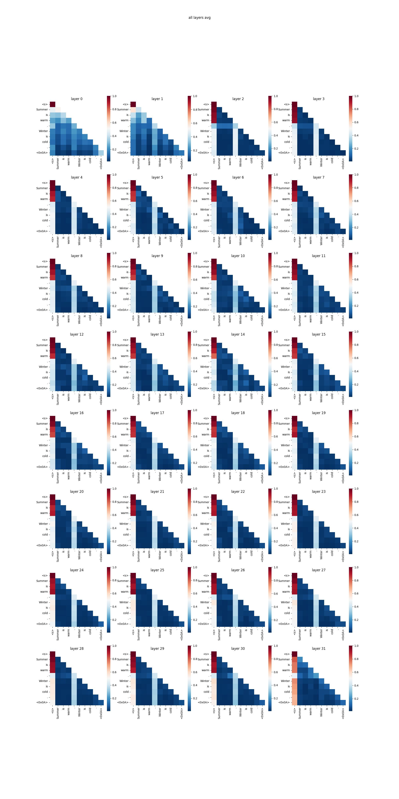
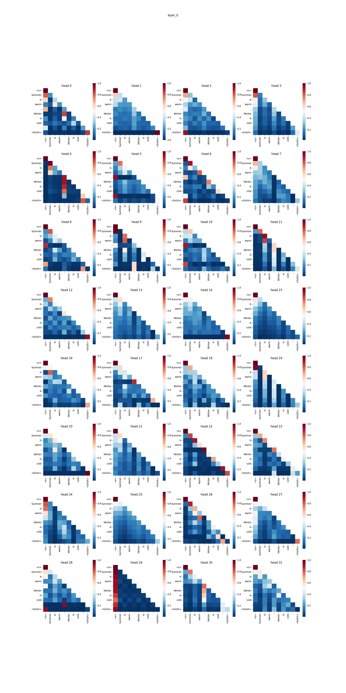
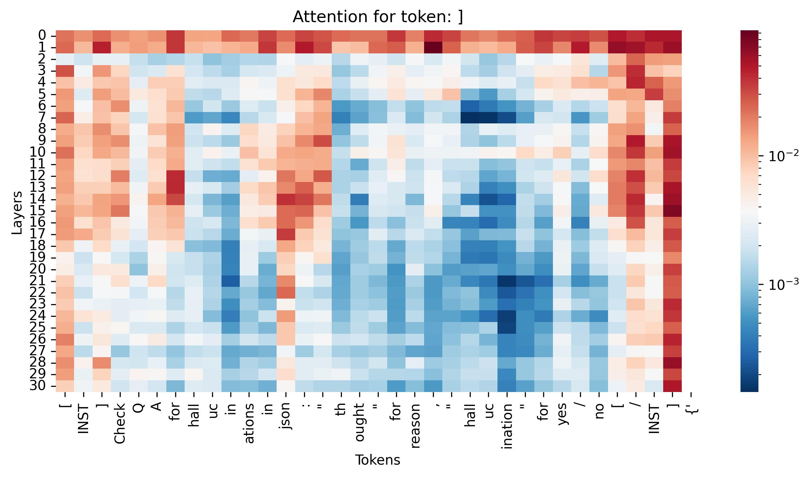

# Attention-Viewer
A tool for visualizing attention-score heatmap in generative LLMs

## Setup
+ Clone this repo:
  ```sh
  git clone https://github.com/LinesHogan/Attention-Viewer.git
  cd Attention-Viewer
  ```
+ Install dependencies:
  ```sh
  conda create -n attn_view python==3.9
  conda activate attn_view
  pip install -e .
  pip install -r requirements.txt
  ```

## Basig Usage
The core function of visualization is `attn_viewer.core.view_attention`, it could be easily plugged into your custom code like:
```python
from attn_viewer.core import view_attention

# model instantialization
model = XXX
model_id = "..."
tokenizer = XXX

# set prompt to be visualized
prompt = "..."

# path to save the results
save_fig_path = '/path/to/results'

# visualize attention
view_attention(
    model=model,  # the model object
    tokenizer=tokenizer,
    prompt=prompt,
    save_fig_path=save_fig_path,
    ...
)
```
The four arguments shown above cover the basic function of this tool. Refer to the example script `main.py` for more implementation details.

## Examples
Here is an example using `main.py` to generate attention heatmaps for `meta-llama/Llama-2-7b-chat-hf`:
```sh
python main.py \
--model_path meta-llama/Llama-2-7b-chat-hf \
--model_id llama2-7b-chat \
--prompt 'Summer is warm. Winter is cold.\n' \
--save_fig_path ./vis 
```
By default, a figure showing each layer's average attention weights along all heads would be saved to `./vis/llama2-7b-chat/all_layers_avg.jpg`:


The `--plot_figs_per_head` argument could be added to generate the heatmap for each head's attention weights in each layer:
```sh
python main.py \
--model_path meta-llama/Llama-2-7b-chat-hf \
--model_id llama2-7b-chat \
--prompt 'Summer is warm. Winter is cold.\n' \
--save_fig_path ./vis \
--plot_figs_per_head
```
The results of the heads in layer i could be found at `./vis/llama2-7b-chat/layer_{i}.jpg`. For example, the figure for layer 0 is:


Moreover, the first token usually attracts so much attention that other tokens' attention scores are hard to distinguish, so the `--ignore_first_token` argument could be added to skip the first token and only plot attention heatmap of other tokens:
```sh
python main.py \
--model_path meta-llama/Llama-2-7b-chat-hf \
--model_id llama2-7b-chat \
--prompt 'Summer is warm. Winter is cold.\n' \
--save_fig_path ./vis \
--ignore_first_token
```


You can change the normalization method for the heatmap by setting `--numerical_norm`. Your choice include 'log', 'linear', 'power'.

### Token Focus

If you are more interested in the view of each token's attention, the `--token_focus` argument could be added to plot the attention heatmap for each token's attention rather than for layers:
```sh
python main.py \
--model_path meta-llama/Llama-2-7b-chat-hf \
--model_id llama2-7b-chat \
--prompt 'Summer is warm. Winter is cold.\n' \
--save_fig_path ./vis \
--token_focus
```



In this setting, you can set the plotting range of layers by `--start_layer` and `--end_layer` arguments. For example, to visualize the attention weights of layer 1 to layer 3:
```sh
python main.py \
--model_path meta-llama/Llama-2-7b-chat-hf \
--model_id llama2-7b-chat \
--prompt 'Summer is warm. Winter is cold.\n' \
--save_fig_path ./vis \
--token_focus
--start_layer 1
--end_layer 3
```

More details and features could be found in the appendix. 

## Advanced Usage: Visualizing Quantized Model's attention
> NOTE: qllm-eval's dependencies should be additionally installed according to their repository to run `main_quant.py`

Along with [thu-nics/qllm-eval](https://github.com/thu-nics/qllm-eval), here we provide `main_quant.py` to visualize the attention weights of quantized models. 

For example, visualize a model's attention under W4A4 quantization:
```sh
python main_quant.py \
--model_path meta-llama/Llama-2-7b-chat-hf \
--model_id llama2-7b-chat_w_4_a_4 \
--prompt 'Summer is warm. Winter is cold.\n' \
--save_fig_path ./vis \
--w_bit 4 \
--a_bit 4
```

Below are the visualization results of W4A8(left) and W4A4(right) quantized models' attention heatmaps:
<div style="display: flex; align-items: center; justify-content: space-around;">
    
    
</div>

It's obvious that the distributions of attention weights in the W4A4 model are quite different from the W4A8 model, where the first special token `.` is no longer attended by other tokens, while the tokens after the first `.` begin to strongly attend the starting token. 


## Appendix
Below is a full list of `attn_viewer.core.view_attention`'s arguments:
+ `model`: The transformers model object.
+ `model_id`: The name you give to the model, which is used to name the result files.
+ `tokenizer`: The tokenizer object.
+ `prompt`: The prompt to be visualized.
+ `ignore_first_token`: A bool value indicating whether to ignore the first token when plotting.
+ `save_attention_scores`: A bool value indicating whether to save the collected attention weights locally (default: 'False'). If set to `True`, a dictionary with the following content would be saved to `{save_attention_scores_path}/{model_id}_attn_scores.pt`:
  ```python
  saved_data = {
      'attention_scores': attention_scores,
      'tokens_list': tokens_list
  }
  ```
  + `attention_scores` would be a list containing each decoder layer's attention weights of the prefilled prompt, where each element would be a tensor with shape `(1, num_heads, seq_len, seq_len)`.
  + `tokens_list` would be a list containing the tokens like: `['<s>', 'Hi', ',', 'how', 'are', 'you', '?']`, and the tokens would be used as xticks and yticks in the heatmaps.
+ `save_attention_scores_path`: The path to save the attention weights if `save_attention_scores=True`. The saved file would be: `{save_attention_scores_path}/{model_id}_attn_scores.pt`.
+ `load_attention_scores_path`: The path to load the locally saved attention weights (to simply plot heatmaps with the given data and avoid duplicated generation process), eg. `{save_attention_scores_path}/{model_id}_attn_scores.pt`. 
  > NOTE: if `load_attention_scores_path` is specified, the arguments `model`, `tokenizer` and `prompt` would all be unnecessary and unused, as the plotting would be operated on the loaded attention weights data. On the contrary, if `load_attention_scores_path` is not specified, `model`, `tokenizer` and `prompt` would be required.
+ `save_fig_path`: The path to save the attention heatmaps. The figures would be saved under this directory: `{save_fig_path}/{model_id}`.
+ `plot_figs_per_head`: A bool value indicating whether to plot the attention heatmap on each attention-head of each layer (default: `False`). If set to `False`, only one figure showing each layer's average attention weights along all heads would be saved to `{save_fig_path}/{model_id}/all_layers_avg.jpg` . And if set to `True`, the attention heatmap of each head of the i'th layer would be saved to `{save_fig_path}/{model_id}/layer_{i}.jpg`, where `i` would be ranged from `0` to `num_hidden_layers-1`.
+ `num_figs_per_row`: An int value indicating how many heatmaps would be filled in one row of a figure (default: `4`).
+ `start_layer`: An int value indicating the starting layer to plot the attention heatmaps (default: `0`).
+ `end_layer`: An int value indicating the ending layer to plot the attention heatmaps (default: `num_hidden_layers-1`).
+ `per_token_focus`: A bool value indicating whether to plot the attention heatmap for each token's attention rather than for layers.
+ `numerical_norm`: The normalization method for the heetmap, could be 'log', 'linear' or 'power' (default: 'log').